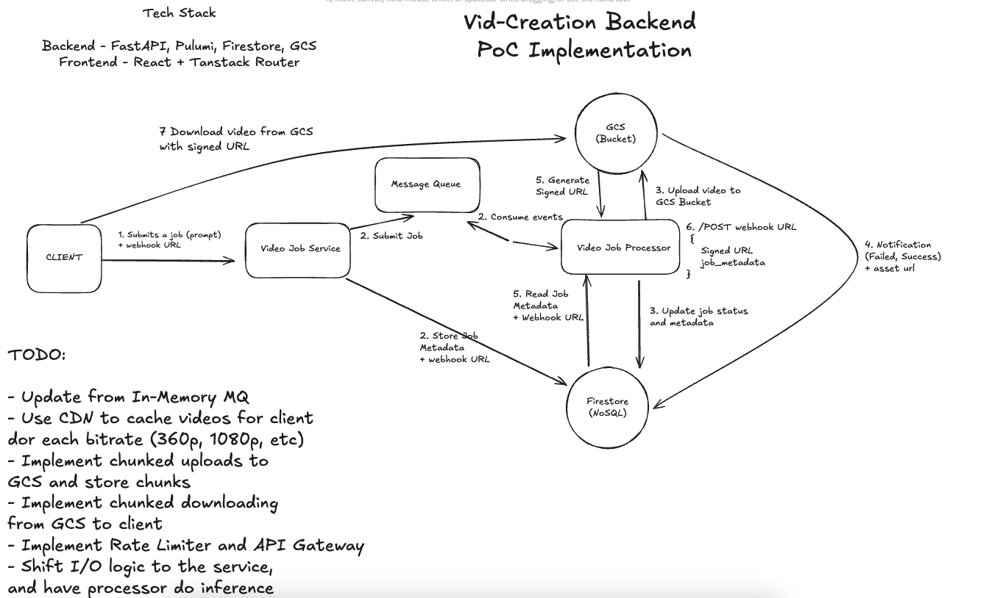

# Video Creation Platform

A modern, full-stack application for AI-powered video generation. Built with React, FastAPI, and Google Cloud Platform.

## 🚀 Features

- **AI Video Generation**: Create videos using advanced AI models
- **Real-time Job Processing**: Monitor job progress with webhook notifications
- **Cloud Storage**: Google Cloud Storage integration for video management
- **Modern UI**: Built with React, TanStack Router, and Tailwind CSS
- **Asynchronous Processing**: Background job processing with status tracking

## NOTE: Enable REPLICATE_API_TOKEN to see text2vid generation, currently using a backup video. 
## NOTE: Demo uses no-auth branch

## 🏗️ Architecture



*Vid-Creation Backend POC Implementation - System Architecture*

### System Overview

The platform follows a microservices architecture with the following key components:

1. **Client** - React frontend application
2. **Video Job Service** - Manages job creation and metadata
3. **Video Job Processor** - Handles video processing and AI model integration
4. **Google Cloud Storage (GCS)** - Stores video files and assets
5. **Firestore** - NoSQL database for job metadata and status tracking

### Workflow

1. **Job Submission**: Client submits a job (prompt) + webhook URL to Video Job Service
2. **Job Processing**: Video Job Service initiates processing and stores metadata in Firestore
3. **Video Processing**: Video Job Processor handles the actual video generation
4. **Storage**: Processed videos are uploaded to GCS Bucket
5. **Status Updates**: Job status and metadata are updated in Firestore
6. **Notifications**: Client receives notifications (Success/Failed) + asset URL
7. **Download**: Client downloads video from GCS using signed URLs

### Frontend
- **Framework**: React with TypeScript
- **Router**: TanStack Router with file-based routing
- **State Management**: TanStack Query for server state
- **Styling**: Tailwind CSS with modern UI components
- **Build Tool**: Vite

### Backend
- **Framework**: FastAPI (Python)
- **Database**: Google Cloud Firestore (NoSQL)
- **Storage**: Google Cloud Storage (GCS)
- **Infrastructure**: Pulumi for GCP deployment

## 📁 Project Structure

```
├── frontend/                 # React application
│   ├── src/
│   │   ├── components/       # Reusable UI components
│   │   ├── contexts/         # React contexts (auth, etc.)
│   │   ├── hooks/           # Custom React hooks
│   │   ├── routes/          # TanStack Router routes
│   │   ├── lib/             # Utility functions
│   │   └── types/           # TypeScript type definitions
│   ├── public/              # Static assets
│   └── package.json         # Frontend dependencies
├── backend/                 # FastAPI application
│   ├── src/
│   │   ├── api/            # API route handlers
│   │   ├── services/       # Business logic services
│   │   │   ├── job_service.py      # Video Job Service
│   │   │   └── processor.py        # Video Job Processor
│   │   ├── models/         # Data models
│   │   ├── repositories/   # Data access layer
│   │   └── schemas/        # Pydantic schemas
│   ├── infra/              # Infrastructure as Code (Pulumi)
│   └── pyproject.toml      # Backend dependencies
└── README.md               # This file
```

## 🛠️ Tech Stack

### Frontend
- **React** - UI framework
- **TypeScript** - Type safety
- **TanStack Router** - File-based routing
- **TanStack Query** - Server state management
- **Tailwind CSS** - Utility-first CSS
- **Vite** - Build tool and dev server

### Backend
- **FastAPI** - Web framework
- **Python 3.11+** - Programming language
- **Pydantic** - Data validation
- **Google Cloud Firestore** - NoSQL database for job metadata
- **Google Cloud Storage** - File storage for videos
- **Pulumi** - Infrastructure as Code

### DevOps
- **Docker** - Containerization
- **Google Cloud Platform** - Cloud infrastructure
- **Pulumi** - Infrastructure management

## 🚀 Getting Started

### Prerequisites

- Node.js 18+ and npm/bun
- Python 3.11+
- Google Cloud Platform account

### Environment Setup

1. **Clone the repository**
   ```bash
   git clone <repository-url>
   cd vid-creation-clean
   ```

2. **Frontend Setup**
   ```bash
   cd frontend
   bun install
   ```

3. **Backend Setup**
   ```bash
   cd backend
   python -m venv .venv
   source .venv/bin/activate  # On Windows: .venv\Scripts\activate
   pip install -e .
   ```

4. **Environment Variables**

   Create `.env` files in both frontend and backend directories:

   **Frontend (.env)**
   ```env
   VITE_API_URL=http://localhost:8000
   ```

   **Backend (.env)**
   ```env
   GOOGLE_APPLICATION_CREDENTIALS=path/to/service-account-key.json
   GCP_STORAGE_BUCKET=your-storage-bucket
   GCP_PROJECT_ID=your-project-id
   ```

### Running the Application

1. **Start the Backend**
   ```bash
   cd backend
   uvicorn src.main:app --reload --port 8000
   ```

2. **Start the Frontend**
   ```bash
   cd frontend
   bun dev
   ```

3. **Access the Application**
   - Frontend: http://localhost:3000
   - Backend API: http://localhost:8000
   - API Documentation: http://localhost:8000/docs

## 🔧 Development

### Frontend Development

```bash
cd frontend

# Development server
bun dev

# Build for production
bun run build

# Run tests
bun test

# Preview production build
bun run preview
```

### Backend Development

```bash
cd backend

# Development server
uvicorn src.main:app --reload

# Run tests
pytest

# Generate API types
python -m scripts.generate_types
```

### Infrastructure

```bash
cd backend/infra

# Deploy to development
pulumi stack select dev
pulumi up

# Deploy to staging
pulumi stack select stage
pulumi up
```

## 📚 API Documentation

The API is documented using OpenAPI/Swagger. When running the backend, visit:
- Swagger UI: http://localhost:8000/docs
- ReDoc: http://localhost:8000/redoc

### Key Endpoints

- **Jobs**
  - `GET /api/jobs` - List user jobs
  - `POST /api/jobs` - Create new video generation job
  - `GET /api/jobs/{job_id}` - Get job details
  - `GET /api/jobs/{job_id}/asset-url` - Get asset download URL

- **Webhooks**
  - `POST /api/webhooks/{job_id}` - Webhook endpoint for job updates
  - `POST /api/webhooks/test` - Test webhook endpoint

## 🎥 Video Generation Workflow

The platform supports AI-powered video generation with the following workflow:

1. **Job Creation**: Client submits a job with prompt and webhook URL
2. **Job Processing**: Video Job Service creates job and stores metadata in Firestore
3. **Video Processing**: Video Job Processor handles AI model integration and video generation
4. **Storage**: Generated videos are uploaded to Google Cloud Storage
5. **Status Updates**: Job status and metadata are updated in Firestore
6. **Notifications**: Client receives webhook notifications with job status and signed URLs
7. **Download**: Client downloads videos using signed URLs from GCS

## 🏗️ Deployment

### Docker Deployment

The backend includes a Dockerfile for containerized deployment. Here are the steps to build and deploy:

#### 1. Build the Docker Image

```bash
cd backend
docker build -t video-creation-backend .
```

#### 2. Run Locally for Testing

```bash
docker run -p 8080:8080 \
  -e GCP_PROJECT_ID=your-project-id \
  -e GCP_STORAGE_BUCKET=your-storage-bucket \
  -e GOOGLE_APPLICATION_CREDENTIALS=/app/credentials.json \
  -v /path/to/service-account-key.json:/app/credentials.json \
  video-creation-backend
```

#### 3. Deploy to Cloud Run (Recommended)

```bash
# Tag the image for Google Container Registry
docker tag video-creation-backend gcr.io/YOUR_PROJECT_ID/video-creation-backend

# Push to Google Container Registry
docker push gcr.io/YOUR_PROJECT_ID/video-creation-backend

# Deploy to Cloud Run
gcloud run deploy video-creation-backend \
  --image gcr.io/YOUR_PROJECT_ID/video-creation-backend \
  --platform managed \
  --region us-central1 \
  --allow-unauthenticated \
  --set-env-vars GCP_PROJECT_ID=YOUR_PROJECT_ID,GCP_STORAGE_BUCKET=YOUR_BUCKET_NAME
```

### Infrastructure Setup with Pulumi

The application uses Pulumi for infrastructure management on Google Cloud Platform:

#### 1. Install Pulumi

```bash
# Install Pulumi CLI
curl -fsSL https://get.pulumi.com | sh

# Install Python dependencies
cd backend/infra
pip install -e .
```

#### 2. Configure Pulumi

```bash
cd backend/infra

# Set your GCP project configuration
pulumi config set gcp_project_id YOUR_PROJECT_ID
pulumi config set gcp_region us-central1
pulumi config set frontend_prod_url https://your-frontend-url.com
```

#### 3. Deploy Infrastructure

```bash
# Deploy to development
pulumi stack select dev
pulumi up

# Deploy to staging
pulumi stack select stage
pulumi up

# Deploy to production
pulumi stack select prod
pulumi up
```

#### 4. Get Deployment Outputs

After deployment, Pulumi will output the necessary environment variables:

```bash
pulumi stack output GCP_PROJECT_ID
pulumi stack output GCP_STORAGE_BUCKET
pulumi stack output --show-secrets GCP_SERVICE_ACCOUNT_JSON
```

### Environment Variables

For production deployment, you'll need these environment variables:

```env
GCP_PROJECT_ID=your-project-id
GCP_STORAGE_BUCKET=your-storage-bucket
GOOGLE_APPLICATION_CREDENTIALS=/app/credentials.json
REPLICATE_API_TOKEN=your_replicate_token  # Optional: for AI video generation
```

### Deployment Options

1. **Google Cloud Run** (Recommended) - Serverless, auto-scaling
2. **Google Kubernetes Engine (GKE)** - For complex deployments
3. **Google Compute Engine** - For full control
4. **Render** - Alternative cloud platform
5. **Railway** - Simple deployment platform

## 🧪 Testing

### Frontend Tests
```bash
cd frontend
bun test
```

### Backend Tests
```bash
cd backend
pytest
```

## 📝 Contributing

1. Fork the repository
2. Create a feature branch (`git checkout -b feature/amazing-feature`)
3. Commit your changes (`git commit -m 'Add amazing feature'`)
4. Push to the branch (`git push origin feature/amazing-feature`)
5. Open a Pull Request

## 📄 License

This project is licensed under the MIT License - see the LICENSE file for details.

## 🤝 Support

For support and questions:
- Create an issue in the repository
- Check the API documentation at `/docs`
- Review the code comments and inline documentation

## 🔮 Roadmap & TODO

### Immediate Improvements
- [ ] **Asynchronous Processing**: Use Pub/Sub or RabbitMQ to handle jobs asynchronously
- [ ] **CDN Integration**: Implement CDN to cache videos for different bitrates (360p, 1080p, etc.)
- [ ] **Chunked Uploads**: Implement chunked uploads to GCS and store chunks
- [ ] **Chunked Downloads**: Implement chunked downloading from GCS to client
- [ ] **Rate Limiting**: Implement Rate Limiter and API Gateway
- [ ] **Service Separation**: Shift I/O logic to the service, and have processor focus on inference

### Future Enhancements
- [ ] Enhanced video processing options
- [ ] Real-time collaboration features
- [ ] Mobile application
- [ ] Integration with additional AI models
- [ ] Performance optimizations
- [ ] Enhanced security features 
